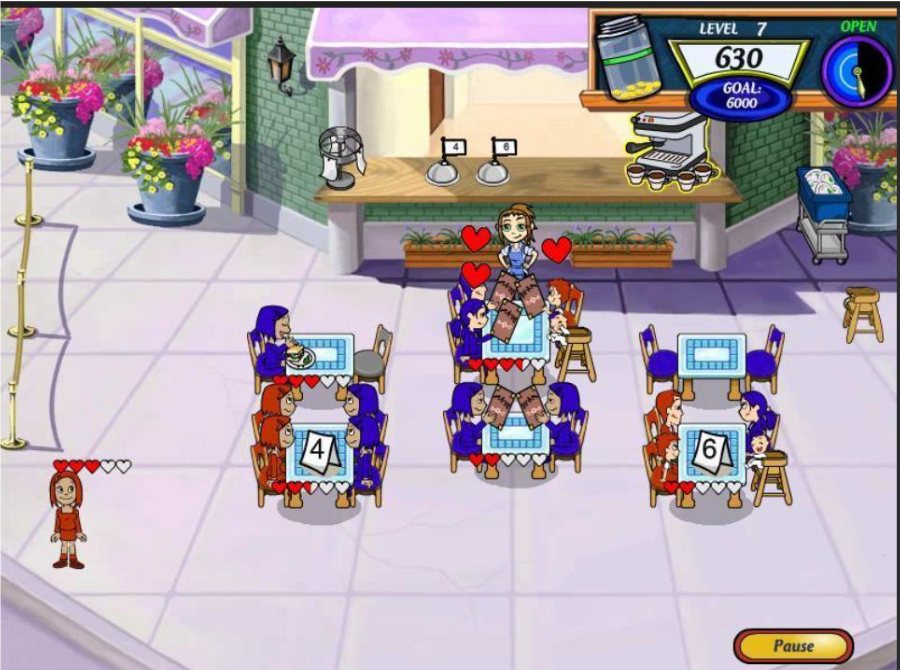
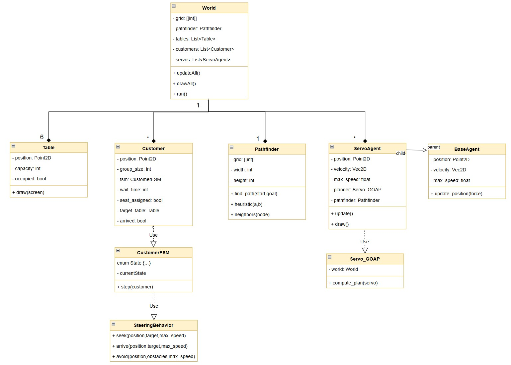
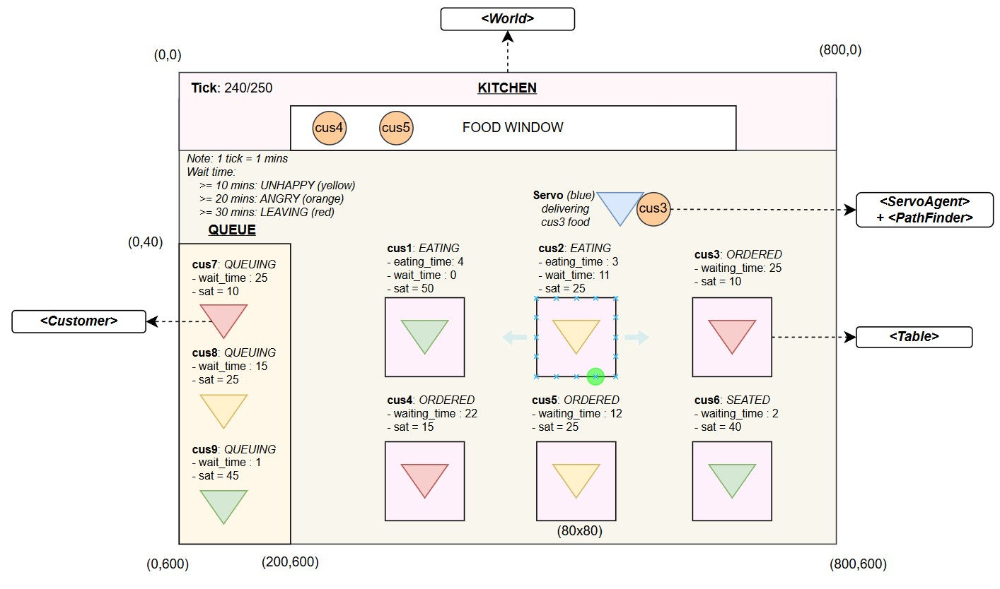
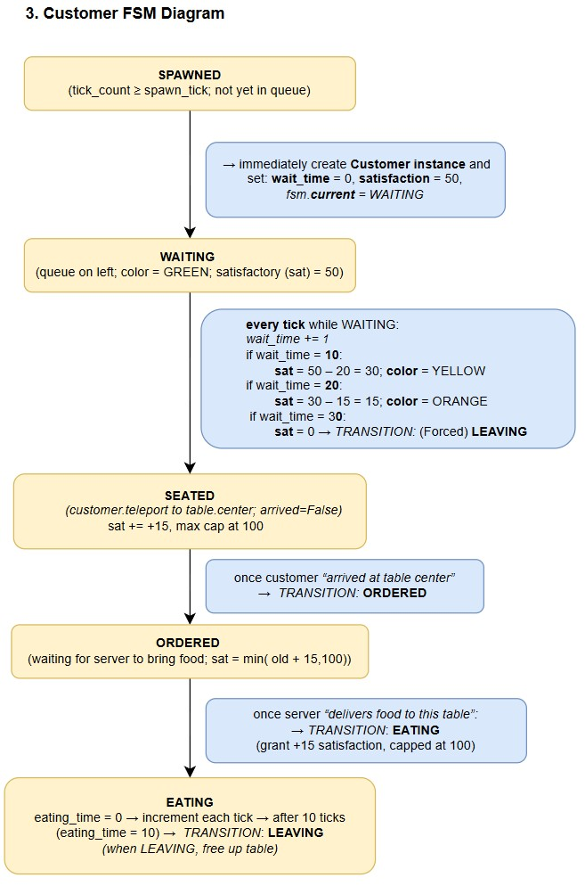
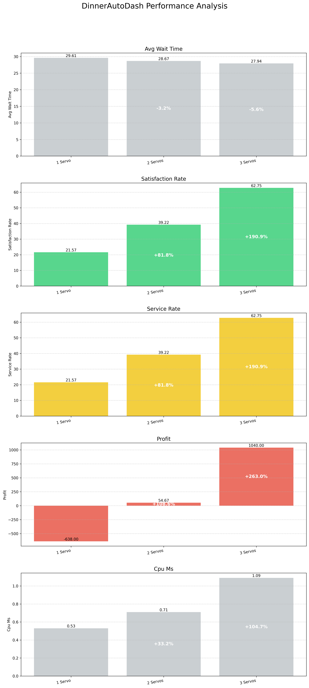
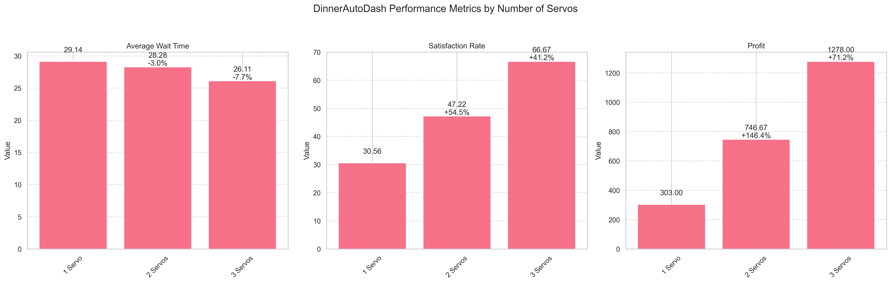

# DinnerAutoDash - HD Research AI for Games

## Project Description
Inspired by the classic game Diner Dash and studies in AI for Games, Dinner AutoDash is a simple 2D restaurant simulation prototype built with Python and Pygame. This project explores the application of in-game AI techniques like FSM, GOAP, Steering, and A* pathfinding in a restaurant management context. The long-term vision includes potential for real-world restaurant simulation and collecting meaningful business insights.


## The Concept
- The world spawns customers at random rates and has six tables arranged in a 3×2 grid
- A left side "queue" of customers whose satisfaction declines over time
- One "servo" agent (the waiter) who uses a GOAP planner + A* pathfinding + steering to seat customers and deliver orders
- Customers follow an FSM (WAITING→ANGRY→LEAVING if not served; SEATED→ORDERED→EATING→LEAVING if served)

## Demo Videos

- **Single servo agent demonstration**: 
  
  

- **Multi-agent simulation with vector motion calculations**: 
  
  


## Installation

1.  **Clone the repository:**

    ```bash
    git clone "https://github.com/Leissha/diner-autodash.git"
    cd DinnerAutoDash
    ```

2.  **Create and activate a virtual environment:**

    ```bash
    python -m venv .venv
    # On Windows:
    .\.venv\Scripts\activate
    # On macOS/Linux:
    source .venv/bin/activate
    ```

3.  **Install dependencies:**

    ```bash
    pip install -r requirements.txt
    ```

## How to Use

1.  **Activate the virtual environment:**

    ```bash
    # On Windows:
    .\.venv\Scripts\activate
    # On macOS/Linux:
    source .venv/bin/activate
    ```

2.  **Run the main script:**

    ```bash
    python main.py
    ```

3.  **Run the batch run script:**

    ```bash
    python batch_run.py
    ```

## Key Folders
### `Diagrams/`
System architecture and workflow diagrams:

#### System Architecture

*UML system design showing the overall architecture*


*GUI interface mockup and layout*

#### Customer Behavior

*Customer Finite State Machine showing emotional states*


*Customer FSM timeline showing state transitions*

#### AI Planning

*GOAP (Goal-Oriented Action Planning) flowchart*


*Servo agent execution plan and decision tree*


## Directory Structure
-   `Actions/`: GOAP actions and pathfinding implementations
-   `Agents/`: AI agent implementations (servo agents)
-   `Customers/`: Customer behavior models and FSM states
-   `Docs/`: Additional documentation and testing notes
-   `Render/`: Visualization components for the simulation


### `insights/`
Performance analysis results including:

#### Performance Metrics

*Overall performance analysis showing key metrics*


*Detailed performance metrics breakdown*